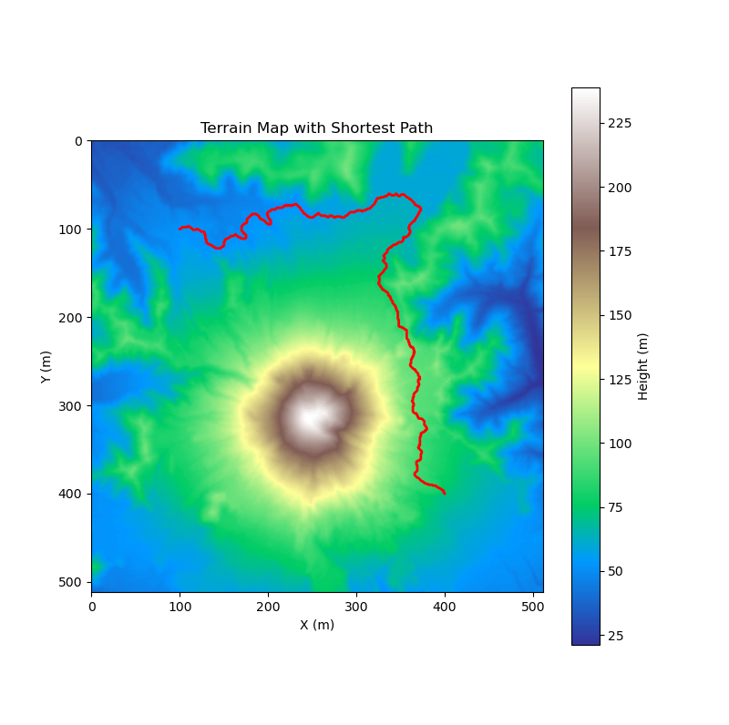
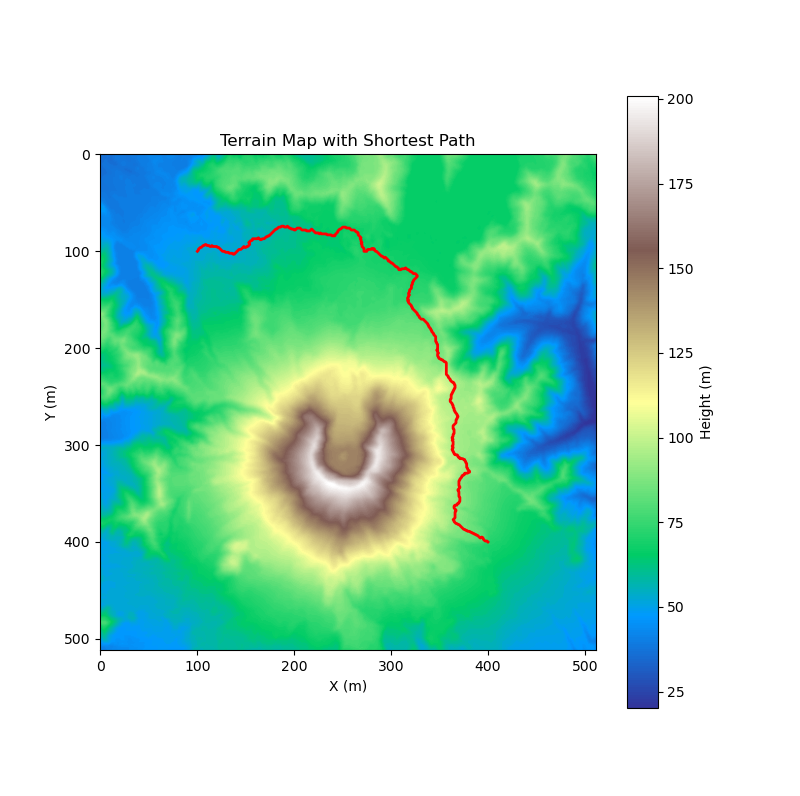

# 3D_Software_Developer_Project

This project calculates the surface distance between two points on a terrain represented by a height map, considering the shortest path.

## Installation

Clone the repository and install the dependencies:

```bash
git clone https://github.com/pareespathak/3D_Software_Developer_Project.git
cd 3D_Software_Developer_Project
pip3 install -r requirements.txt
```
### RUN

```
python shortest_path.py 100,100 400,400
```

Here, the coordinates are in the form of x,y.

Point A: 100,100
Point B: 400,400

The script will output the surface distance between the two points and the difference in distance between pre- and post-eruption height maps.
For the above points the Difference of path lengths:  330.0 Meters

Visualization
For visualization, run the script. It will generate visualizations showing the terrain and the shortest path between the points.
Uncomment the lines for visualization of the pre / post eruption maps

## Results:
 |  
-----------------------------------------|------------------------------------------
Pre Eruption Image | Post Eruption Image
